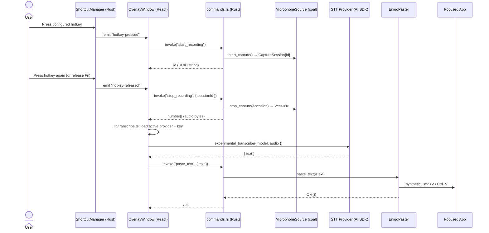

# Architecture

Vox Era is a cross-platform desktop app built on **Tauri 2** (Rust + WebView). A global keyboard shortcut toggles recording; the captured audio is sent to one of nine pluggable STT providers via Vercel AI SDK; the transcribed text is copied to the clipboard and pasted into the focused application via a synthetic `Cmd+V` (or `Ctrl+V`) keystroke.

This document describes the *as-built* architecture. The plan-of-record is `docs/superpowers/plans/2026-05-03-plan-b-desktop-app.md`; this doc references it for canonical truth.

## Process model

Tauri runs two logical layers, each with a distinct responsibility:

- **Rust core (`packages/desktop/src-tauri/`)** — owns the app lifecycle, the system tray, global shortcut registration (including the macOS Fn-key `CGEventTap` fallback), audio capture via [`cpal`](https://crates.io/crates/cpal), per-platform microphone permission flows, secret storage in the OS keychain via [`keyring`](https://crates.io/crates/keyring), SQLite history via [`sqlx`](https://crates.io/crates/sqlx) + the Tauri SQL plugin, synthetic paste via [`enigo`](https://crates.io/crates/enigo), and the `#[tauri::command]` surface that the webview calls into.
- **WebView (`packages/desktop/src/`)** — React 18 + Vite + TypeScript. Two windows: the main settings/dashboard window and a transparent always-on-top overlay. The webview owns no privileged work; it talks to the Rust core exclusively through the `vox.*` typed wrapper around `@tauri-apps/api`'s `invoke`.

There is no Node runtime in the renderer. There is no preload script in the Electron sense. Tauri's capability system (`packages/desktop/src-tauri/capabilities/default.json`) restricts which plugins the webview can call.

## File map

### Rust core (`packages/desktop/src-tauri/src/`)

| File | Role |
|---|---|
| `lib.rs` | Crate entry. Wires plugins (clipboard-manager, global-shortcut, sql, store, updater), constructs `AppState`, registers `invoke_handler!` over `commands::*`, builds the tray. |
| `main.rs` | Thin binary entry that calls `voxera_lib::run()`. |
| `commands.rs` | Every `#[tauri::command]` lives here. Composes traits from `audio`, `secrets`, `paste`. |
| `audio/mod.rs` | `AudioSource` trait, `PermissionState`, `AudioError`, `CaptureSession`. |
| `audio/microphone.rs` | `MicrophoneSource` — the cpal-backed production impl. |
| `audio/mock.rs` | `MockMicrophoneSource` for tests. |
| `audio/permissions/{macos,windows,linux}.rs` | Per-platform mic + accessibility permission flows. macOS uses `objc2-av-foundation::AVCaptureDevice`. |
| `secrets/mod.rs` | `Vault` trait, `SecretKey` newtype with redacted `Debug`, `SecretsError`. |
| `secrets/keyring_vault.rs` | Production impl over `keyring` crate (Apple Keychain / Windows Credential Manager / libsecret). |
| `secrets/mock.rs` | `InMemoryVault` for tests. |
| `settings/mod.rs` | Settings struct + defaults; persisted via `tauri-plugin-store`. |
| `history/mod.rs` | SQL plugin migration registration. `migrations()` returns the `Migration` list; `DB_URL` is the canonical sqlite URL. |
| `history/repo.rs` | `Transcription`, `NewTranscription`; CRUD via `sqlx` (insert / list / soft_delete / purge_all). |
| `history/stats.rs` | Aggregate queries (count, total duration, by-provider breakdown, etc.). |
| `history/retention.rs` | Rolling 1-year purge job. |
| `shortcut/mod.rs` | `ShortcutManager` trait + `HotkeyCombo` enum (`Fn` macOS-only, `Standard { combo }`). |
| `shortcut/standard.rs` | Wrapper around `tauri-plugin-global-shortcut`. |
| `shortcut/macos_fn.rs` | macOS `CGEventTap`-based Fn-key listener. |
| `tray/mod.rs` | Tray icon + menu (built programmatically; no PNG asset). |
| `clipboard/mod.rs` | `Clipboard` trait + `InMemoryClipboard` (the `EnigoPaster` owns the real clipboard via `tauri-plugin-clipboard-manager`). |
| `paste/mod.rs` | `Paster` trait + `EnigoPaster` (writes clipboard, posts `Cmd/Ctrl+V` via `enigo`). |

### WebView (`packages/desktop/src/`)

| File | Role |
|---|---|
| `main.tsx` | React entry; mounts `<App />`. |
| `App.tsx` | Window dispatcher — inspects `window.location.search` for `?window=overlay` and renders `<OverlayWindow>` or `<MainWindow>` accordingly. |
| `lib/invoke.ts` | The `vox.*` typed wrapper. **All** Tauri command calls go through here. |
| `lib/transcribe.ts` | End-to-end transcription orchestration. Reads active provider/model from settings, fetches the API key via `vox.getSecret`, builds the `TranscriptionModel` via `provider.makeModel`, calls `experimental_transcribe` from `ai`. |
| `providers/types.ts` | `ProviderConfig`, `Model`, `PricingEntry`. |
| `providers/index.ts` | The `PROVIDERS` registry array — the only place new providers are wired in. |
| `providers/<id>.ts` (×9) | One file per STT provider: assemblyai, azure-openai, deepgram, elevenlabs, fal, gladia, groq, openai, revai. |
| `windows/main/MainWindow.tsx` | The 4-tab settings window (Dashboard / History / Settings / About). |
| `windows/overlay/OverlayWindow.tsx` | The transparent recording overlay. |
| `components/ui/*` | shadcn-neobrutalism primitives (Button, Card, Input, Tabs, etc.). |

## Tauri command surface

Every webview-callable Rust function lives in `commands.rs` and has a typed mirror in `lib/invoke.ts`. As of this writing:

| Command | Args | Returns | Implementation |
|---|---|---|---|
| `check_microphone_permission` | — | `PermissionState` | `state.audio.check_permission()` |
| `request_microphone_permission` | — | `PermissionState` | `state.audio.request_permission()` |
| `check_accessibility_permission` | — | `PermissionState` | `audio::permissions::check_accessibility_permission()` |
| `request_accessibility_permission` | — | `()` | `audio::permissions::request_accessibility_permission()` |
| `open_settings_panel` | `panel: "microphone" \| "accessibility"` | `()` | `open_settings_microphone_panel` / `open_settings_accessibility_panel` |
| `start_recording` | — | `String` (session UUID) | `state.audio.start_capture()` |
| `stop_recording` | `session_id: String` | `Vec<u8>` (raw audio bytes) | `state.audio.stop_capture(&CaptureSession{ id })` |
| `get_secret` | `provider_id: String` | `Option<String>` | `state.vault.get(&provider_id)` |
| `set_secret` | `provider_id, key: String` | `()` | `state.vault.set(&provider_id, &key)` |
| `delete_secret` | `provider_id: String` | `()` | `state.vault.delete(&provider_id)` |
| `list_configured_providers` | — | `Vec<String>` | `state.vault.list_configured()` |
| `paste_text` | `text: String` | `()` | `state.paster.paste_text(&text)` (writes clipboard + posts paste keystroke) |

The TS wrapper `vox` in `src/lib/invoke.ts` exposes each of these as a method with the corresponding typed signature.

## Recording flow (end-to-end)
Ada is a macOS Electron app. A global keyboard shortcut toggles
recording; the captured audio is sent to OpenAI Whisper for
transcription; the transcribed text is copied to the clipboard and
pasted into the focused application via simulated `Cmd+V`.

## Process model

Electron runs three logical layers, each with a distinct responsibility:

- **Main process (`main.js`)** — owns the app lifecycle, the system
  tray, the global shortcut registration, and all privileged work:
  reading `config.json`, calling the Whisper API over `fetch`, writing
  to the system clipboard via `pbcopy`, and posting the synthetic
  `Cmd+V` keystroke via `CGEventPost`.
- **Renderer process (`renderer.js` loaded by `index.html`)** — owns
  the microphone. Uses the browser `MediaRecorder` API to capture WebM
  audio. Has no direct OS access; communicates with main exclusively
  through the preload bridge.
- **Preload (`preload.js`)** — the IPC bridge. Runs with
  `contextIsolation: true` and `nodeIntegration: false`, exposing a
  small typed surface on `window.ada` to the renderer.

## File map

| File | Role |
|---|---|
| `main.js` | Main process entry. App, tray, shortcut, Whisper, paste. |
| `renderer.js` | Renderer logic. MediaRecorder + UI status updates. |
| `preload.js` | IPC bridge. Exposes `window.ada` to the renderer. |
| `index.html` | Hidden status window the renderer runs inside. |
| `dashboard.html` | Optional dashboard window opened from the tray menu. |
| `entitlements.plist` | Microphone entitlement signed into the bundle. |
| `paste-helper.swift` / `paste-helper` | Standalone Swift binary that does clipboard + `Cmd+V`. **Not currently invoked at runtime** (main.js uses an inline JXA `osascript` instead). Kept as a fallback. |
| `config.json` | OpenAI API key + model name. Gitignored. |
| `trayIconTemplate.png` (+`@2x`) | Tray icon, template-rendered for macOS dark/light. |

## IPC contract

The preload bridge exposes exactly two functions on `window.ada`:

| Name | Direction | Payload | Returns |
|---|---|---|---|
| `onToggleRecording(callback)` | main → renderer | `boolean` (true = start, false = stop) | n/a |
| `transcribe(audioBuffer)` | renderer → main | `number[]` (Uint8Array serialized as plain array) | `{ success: true, text: string } \| { success: false, error: any }` |

The main process triggers `toggle-recording` from the registered
global shortcut handler. The renderer responds by starting or stopping
`MediaRecorder` and, on stop, invoking `transcribe` with the
accumulated audio.

## End-to-end flow



For *why* each privileged step is needed and how it's gated, see [Permissions](permissions.md). For how the secret used in `experimental_transcribe` reaches the webview safely, see [Secrets](secrets.md). For how to add a tenth provider, see [Providers](providers.md).

## Spec cross-references

The canonical descriptions of each subsystem live in `docs/superpowers/plans/2026-05-03-plan-b-desktop-app.md`:

- §3 — Process model and module layout
- §6.1–6.2 — Rust traits and command surface
- §6.3 — Permissions per platform
- §6.4 — Secrets storage
- §6.7 — Provider registry
- §6.10 — Paste pipeline (clipboard + keystroke)
- §6.11 — Recording sequence
    participant Main as main.js
    participant Render as renderer.js
    participant Whisper as OpenAI Whisper
    participant Focused as Focused App

    User->>Main: Press Ctrl+Shift+Space
    Main->>Render: send("toggle-recording", true)
    Render->>Render: MediaRecorder.start()
    User->>Main: Press Ctrl+Shift+Space (again)
    Main->>Render: send("toggle-recording", false)
    Render->>Render: MediaRecorder.stop()
    Render->>Main: invoke("transcribe", uint8[])
    Main->>Whisper: POST /v1/audio/transcriptions (multipart)
    Whisper-->>Main: { text: "..." }
    Main->>Main: pbcopy text
    Main->>Focused: CGEvent Cmd+V
    Main-->>Render: { success: true, text }
    Render->>User: Status: "Pasted!"
```

For the build-time concerns that surround this runtime flow, see
[Build & Release](build-and-release.md). For the permissions each step
requires, see [Permissions](permissions.md).
