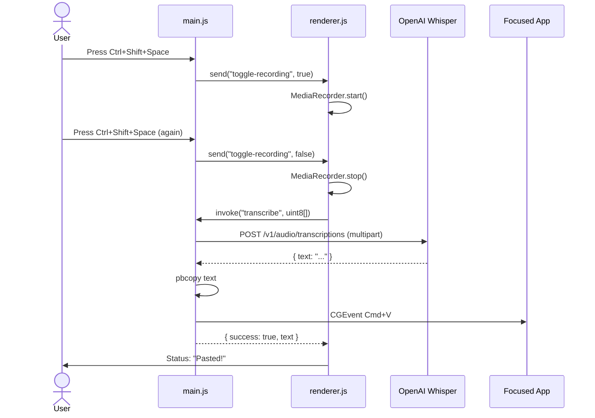

# Architecture

Ada is a macOS Electron app. A global keyboard shortcut toggles
recording; the captured audio is sent to OpenAI Whisper for
transcription; the transcribed text is copied to the clipboard and
pasted into the focused application via simulated `Cmd+V`.

## Process model

Electron runs three logical layers, each with a distinct responsibility:

- **Main process (`main.js`)** — owns the app lifecycle, the system
  tray, the global shortcut registration, and all privileged work:
  reading `config.json`, calling the Whisper API over `fetch`, writing
  to the system clipboard via `pbcopy`, and posting the synthetic
  `Cmd+V` keystroke via `CGEventPost`.
- **Renderer process (`renderer.js` loaded by `index.html`)** — owns
  the microphone. Uses the browser `MediaRecorder` API to capture WebM
  audio. Has no direct OS access; communicates with main exclusively
  through the preload bridge.
- **Preload (`preload.js`)** — the IPC bridge. Runs with
  `contextIsolation: true` and `nodeIntegration: false`, exposing a
  small typed surface on `window.ada` to the renderer.

## File map

| File | Role |
|---|---|
| `main.js` | Main process entry. App, tray, shortcut, Whisper, paste. |
| `renderer.js` | Renderer logic. MediaRecorder + UI status updates. |
| `preload.js` | IPC bridge. Exposes `window.ada` to the renderer. |
| `index.html` | Hidden status window the renderer runs inside. |
| `dashboard.html` | Optional dashboard window opened from the tray menu. |
| `entitlements.plist` | Microphone entitlement signed into the bundle. |
| `paste-helper.swift` / `paste-helper` | Standalone Swift binary that does clipboard + `Cmd+V`. **Not currently invoked at runtime** (main.js uses an inline JXA `osascript` instead). Kept as a fallback. |
| `config.json` | OpenAI API key + model name. Gitignored. |
| `trayIconTemplate.png` (+`@2x`) | Tray icon, template-rendered for macOS dark/light. |

## IPC contract

The preload bridge exposes exactly two functions on `window.ada`:

| Name | Direction | Payload | Returns |
|---|---|---|---|
| `onToggleRecording(callback)` | main → renderer | `boolean` (true = start, false = stop) | n/a |
| `transcribe(audioBuffer)` | renderer → main | `number[]` (Uint8Array serialized as plain array) | `{ success: true, text: string } \| { success: false, error: any }` |

The main process triggers `toggle-recording` from the registered
global shortcut handler. The renderer responds by starting or stopping
`MediaRecorder` and, on stop, invoking `transcribe` with the
accumulated audio.

## End-to-end flow

For the build-time concerns that surround this runtime flow, see
[Build & Release](build-and-release.md). For the permissions each step
requires, see [Permissions](permissions.md).
