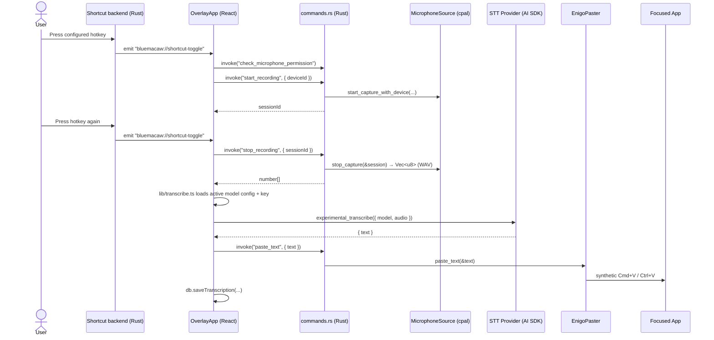

# Architecture

bluemacaw is a cross-platform desktop app built on **Tauri 2** (Rust + WebView). A global keyboard shortcut toggles recording; the captured audio is sent to one of nine pluggable STT providers via the Vercel AI SDK; the transcribed text is copied to the clipboard and pasted into the focused application via a synthetic `Cmd+V` (or `Ctrl+V`) keystroke.

This document describes the *as-built* architecture. The original plan is `docs/superpowers/plans/2026-05-03-plan-b-desktop-app.md`, extended mid-flight by `docs/superpowers/plans/2026-05-10-recording-settings-and-history.md`. Where the as-built diverges from those plans, this doc is the source of truth.

## Process model

Tauri runs two logical layers:

- **Rust core (`packages/desktop/src-tauri/`)** — app lifecycle, system tray, global shortcut registration (including the macOS Fn-key `CGEventTap` fallback), audio capture via [`cpal`](https://crates.io/crates/cpal), per-platform permission flows, secret storage in the OS keychain via [`keyring`](https://crates.io/crates/keyring), synthetic paste via [`enigo`](https://crates.io/crates/enigo), SQL migration registration for the Tauri SQL plugin, and the `#[tauri::command]` surface that the webview calls.
- **WebView (`packages/desktop/src/`)** — React 18 + Vite + TypeScript. Two windows: a settings/dashboard window (`main`) and a transparent always-on-top overlay (`overlay`). The webview owns no privileged work; it talks to the Rust core exclusively through the `vox.*` typed wrapper around `@tauri-apps/api`'s `invoke`. Settings persistence, history CRUD, retention sweeps, and stats live JS-side against the SQL plugin via [`@tauri-apps/plugin-sql`](https://v2.tauri.app/plugin/sql/) — the original plan had a Rust-side `history` module; the as-built consolidates that into TypeScript at `lib/db.ts`.

There is no Node runtime in the renderer. There is no preload script. Tauri's capability system (`packages/desktop/src-tauri/capabilities/default.json`) restricts which plugins the webview can call.

## File map

### Rust core (`packages/desktop/src-tauri/src/`)

| File | Role |
|---|---|
| `lib.rs` | Crate entry. Wires plugins (clipboard-manager, global-shortcut, sql, store, updater), constructs `AppState`, registers the `invoke_handler!`, builds the tray, converts the overlay window to a non-activating `NSPanel` on macOS, and installs the close-to-tray window handler. |
| `main.rs` | Thin binary entry that calls `bluemacaw_lib::run()`. |
| `commands.rs` | Every `#[tauri::command]`. Defines `AppState` and `HostOs` / `PlatformInfo`. |
| `markers.rs` | String constants for Tauri events (`bluemacaw://shortcut-toggle`, `bluemacaw://shortcut-cancel`) and error markers (`accessibility-required:`, `mic-denied:`, `wayland-paste-unsupported:`, `input-monitoring-required:`). Mirrored in `src/lib/markers.ts`; a contract test parses this file to enforce agreement. |
| `platform/mod.rs` | `is_wayland_session()` helper (`XDG_SESSION_TYPE` / `WAYLAND_DISPLAY` probe). |
| `audio/mod.rs` | `AudioSource` trait, `PermissionState`, `AudioError`, `AudioDeviceInfo`, `CaptureSession`. |
| `audio/microphone.rs` | `MicrophoneSource` — the cpal-backed production impl. Owns session bookkeeping and peak-level metering. |
| `audio/permissions/mod.rs` | `SettingsPanel` enum + per-OS dispatch. |
| `audio/permissions/{macos,windows,linux}.rs` | Per-platform mic, accessibility, and input-monitoring permission flows. macOS calls `AVCaptureDevice.requestAccess` via `objc2-av-foundation`. |
| `secrets/mod.rs` | `Vault` trait (3 methods: `get` / `set` / `delete`), `SecretKey` newtype with redacted `Debug`, `SecretsError`, `SERVICE_NAME = "bluemacaw"`. |
| `secrets/keyring_vault.rs` | Production impl over the `keyring` crate (Apple Keychain / Windows Credential Manager / libsecret). |
| `secrets/mock.rs` | `InMemoryVault` for tests. |
| `history/mod.rs` | Migration registration only. `DB_URL = "sqlite:bluemacaw.db"`; `migrations()` returns the two `Migration`s (transcriptions table; api_keys + model_configs + app_state tables). All data access happens JS-side via `src/lib/db.ts`. |
| `shortcut/mod.rs` | `HotkeyCombo` enum (`Fn` macOS-only / `Standard { combo }`), `ShortcutError`. |
| `shortcut/parse.rs` | `parse_combo` / `format_combo` for the `"Cmd+Shift+Space"` style strings used by the settings UI. |
| `shortcut/macos_fn.rs` | macOS `CGEventTap`-based Fn-key listener. |
| `tray/mod.rs` | Tray icon + menu (built programmatically; no PNG asset). Emits `TrayEvent::Open` / `Quit`. |
| `overlay_panel.rs` | macOS-only. Converts the overlay `NSWindow` into a non-activating `NSPanel` so clicks on the recording pill don't steal focus from the app being dictated into. |
| `clipboard/mod.rs` | `Clipboard` trait + `TauriClipboard` (production, via `tauri-plugin-clipboard-manager`) + `InMemoryClipboard` (test). |
| `paste/mod.rs` | `Paster` trait + `EnigoPaster` (writes clipboard, posts `Cmd/Ctrl+V` via `enigo`). |

Migration SQL lives in `packages/desktop/src-tauri/migrations/` (`0001_init.sql`, `0002_provider_configs.sql`).

### WebView (`packages/desktop/src/`)

| File | Role |
|---|---|
| `main.tsx` | React entry; mounts `<App />`. Clears html/body bg on the overlay window so the native transparent panel shows through. |
| `App.tsx` | Window dispatcher — reads `?window=overlay` from the URL and renders `<OverlayApp>` or `<MainWindow>`. Also kicks off initial hotkey registration and the daily history-retention sweep. |
| `lib/invoke.ts` | The `vox.*` typed wrapper. **All** Tauri command calls go through here. |
| `lib/markers.ts` | Mirrors `markers.rs` (event names + error prefixes). |
| `lib/transcribe.ts` | End-to-end transcription orchestration. Resolves the active model config, fetches the API key via `vox.getSecret`, builds the `TranscriptionModel` via `provider.makeModel`, calls `experimental_transcribe` from `ai`. |
| `lib/recording-controller.ts` | Pure state machine (`idle` / `recording` / `transcribing` / `error`) used by both window contexts. Gates microphone permission, calls `vox.startRecording` / `vox.stopRecording`, runs transcribe, attempts paste, saves to history. |
| `lib/overlay-bridge.ts` | Listens for `EVT_SHORTCUT_TOGGLE` / `EVT_SHORTCUT_CANCEL` from Rust and drives the recording controller from either window. |
| `lib/db.ts` | All SQL access (api_keys, model_configs, transcriptions, app_state). Settings (hotkey, cancel hotkey, retention days, selected mic device, overlay enabled/position, theme) live in `app_state` as key/value rows. |
| `lib/onboarding.ts`, `lib/use-onboarding-gate.ts`, `lib/use-onboarding-status.ts` | First-launch onboarding flag in `tauri-plugin-store` + polling hooks that surface the per-platform permission set. |
| `lib/platform.ts`, `lib/use-platform.ts` | Maps `PlatformInfo` to the set of `PermissionKey`s the onboarding screen must render. |
| `lib/export.ts` | TXT / Markdown export helpers for the History tab. |
| `providers/types.ts` | `ProviderConfig`, `Model`, `PricingEntry`. |
| `providers/index.ts` | The `PROVIDERS` registry array — the only place new providers are wired in. |
| `providers/<id>.ts` (×9) | One file per STT provider: assemblyai, azure-openai, deepgram, elevenlabs, fal, gladia, groq, openai, revai. |
| `providers/util.ts` | `providerName` / `formatPricePerMin` / `modelPriceLabel` helpers. |
| `windows/main/MainWindow.tsx` | Settings shell with seven tabs: Dashboard, History, API Keys, Model Configs, Recording, Overlay, Theme/Updates. |
| `windows/main/OnboardingScreen.tsx` | First-launch permission walkthrough. |
| `windows/main/{Dashboard,History,SettingsApiKeys,SettingsModelConfigs,SettingsRecording,SettingsOverlay,SettingsHistory,SettingsTheme,SettingsUpdates,RecordingStatusPill}.tsx` | Individual settings panels and dashboard widgets. |
| `windows/main/{AddApiKeyDialog,AddModelConfigDialog,DeleteApiKeyDialog}.tsx` | Dialogs for managing keychain-stored API keys and the model configs that pin a `{api_key, model_id}` pair. |
| `windows/overlay/{OverlayApp,OverlayWindow}.tsx` | Transparent recording overlay with level meter and cancel button. |
| `components/HotkeyInput.tsx`, `hooks/useHotkeyRecording.ts` | Capture-a-hotkey input used by Settings → Recording. |
| `components/ui/*` | shadcn-neobrutalism primitives (Button, Card, Input, Tabs, Dialog, Switch, Label, Toast, etc.). |

## Tauri command surface

Every webview-callable Rust function lives in `commands.rs` and is mirrored on `vox.*` in `lib/invoke.ts`.

| Command | Args | Returns | Notes |
|---|---|---|---|
| `check_microphone_permission` | — | `PermissionState` | |
| `request_microphone_permission` | — | `PermissionState` | Triggers the OS prompt. |
| `check_accessibility_permission` | — | `PermissionState` | Non-prompting; safe for status polling. |
| `check_accessibility_permission_prompting` | — | `PermissionState` | Opens System Settings on the first untrusted call. macOS only behaviour. |
| `request_accessibility_permission` | — | `()` | Calls `AXIsProcessTrustedWithOptions` with the prompt option. |
| `check_input_monitoring_permission` | — | `PermissionState` | Distinct TCC bucket from Accessibility on macOS; required for the Fn-key `CGEventTap`. |
| `request_input_monitoring_permission` | — | `PermissionState` | Kicks off the macOS Input Monitoring authorisation flow. |
| `open_settings_panel` | `panel: "microphone" \| "accessibility" \| "input-monitoring"` | `()` | Deep-links the user to the relevant System Settings pane. |
| `start_recording` | `deviceId?: string` | `string` (session UUID) | |
| `stop_recording` | `sessionId: string` | `number[]` (WAV bytes) | Returns PCM16 WAV the webview can hand straight to `experimental_transcribe`. |
| `cancel_recording` | `sessionId: string` | `()` | Drops buffered samples; no STT request is made. |
| `get_recording_level` | `sessionId: string` | `number` | Loudest sample since last call, 0..1; the Rust side resets the tracked peak on each read. |
| `list_audio_input_devices` | — | `AudioDeviceInfo[]` | |
| `get_secret` | `secretId: string` | `string \| null` | `secretId` is an opaque stable string (an `api_keys.id` UUID, not the provider id). |
| `set_secret` | `secretId: string, key: string` | `()` | |
| `delete_secret` | `secretId: string` | `()` | |
| `paste_text` | `text: string` | `()` | Writes the clipboard and posts `Cmd/Ctrl+V` via `enigo`. |
| `register_hotkey` | `combo: string` | `string` | Combo accepts `"Fn"` (macOS only) or `"Mod+Mod+Key"` notation. Returns the normalized combo string. |
| `unregister_hotkey` | — | `()` | |
| `register_cancel_hotkey` | `combo: string` | `string` | Independent of the toggle hotkey. |
| `unregister_cancel_hotkey` | — | `()` | |
| `get_fn_usage_type` | — | `number \| null` | macOS only. Reads `AppleFnUsageType`. |
| `set_fn_usage_type` | `value: number` | `()` | macOS only. Writes `AppleFnUsageType` and restarts cfprefsd. |
| `get_platform_info` | — | `PlatformInfo` | `{ os: "macos"\|"windows"\|"linux", isWayland }`. Drives onboarding's per-platform permission rows. |
| `restart_app` | — | `()` | Used after macOS Accessibility / Input Monitoring grants, since TCC doesn't propagate into a running process. |

## Events (Rust → webview)

Rust emits two events the webview listens for via `@tauri-apps/api/event`:

- `bluemacaw://shortcut-toggle` — toggle hotkey was pressed; `overlay-bridge.ts` drives the controller.
- `bluemacaw://shortcut-cancel` — cancel hotkey was pressed; controller transitions back to idle.

Both names are defined in `markers.rs` / `markers.ts` and pinned by a contract test that parses the Rust file as text.

## Recording flow (end-to-end)

If paste fails (e.g. macOS Accessibility revoked, or Wayland blocks synthetic keystrokes), the text still lands on the clipboard and the history row is still saved. The error marker is translated into a UI-friendly message in `recording-controller.ts`.

For *why* each privileged step is gated, see [`permissions.md`](./permissions.md). For how the key reaches `experimental_transcribe`, see [`secrets.md`](./secrets.md). For adding a tenth provider, see [`providers.md`](./providers.md).

## Plan vs. as-built divergences

The original Plan B specified a few subsystems that ended up shaped differently once implementation started:

- **History / settings persistence** — planned as Rust modules (`history/{repo,stats,retention}.rs`, `settings/mod.rs`); shipped as TypeScript in `lib/db.ts` against `tauri-plugin-sql`. The Rust `history/mod.rs` only registers migrations now. Trade-off: simpler one-process data access, easier testing with better-sqlite3 in `db-harness.ts`; no shared Rust type for history rows (the TS interface is the contract).
- **Vault key naming** — planned as `provider_id` strings; shipped using opaque `api_keys.id` UUIDs so a user can store multiple keys per provider ("Personal" / "Work" etc.) and pin each model config to a specific key.
- **Three TCC buckets on macOS, not two** — Plan B treated Accessibility as the umbrella for both `CGEventPost` (paste) and `CGEventTap` (Fn-key); the actual TCC behaviour separates these into Accessibility (paste) and Input Monitoring (Fn-key tap). The Rust side exposes `check_input_monitoring_permission` / `request_input_monitoring_permission` as distinct commands and `Info.plist` carries `NSInputMonitoringUsageDescription`.
- **Cancel hotkey** — added as a separate global shortcut (default `Cmd+Esc`) so users can abort a recording without producing audio. Independent of the toggle hotkey; both registrations coexist.
- **Onboarding flow** — a first-launch permission walkthrough lives in `OnboardingScreen.tsx` + `use-onboarding-gate.ts`. Completion is tracked in `tauri-plugin-store` (`bluemacaw-onboarding.bin`).
- **Multiple API keys per provider** — the `api_keys` + `model_configs` SQL schema is the as-built; the original plan stored one key per provider.

## Spec cross-references

- `docs/superpowers/plans/2026-05-03-plan-b-desktop-app.md` — original spec.
- `docs/superpowers/plans/2026-05-10-recording-settings-and-history.md` — mid-flight expansion covering hotkey customisation, device selection, multi-key support, history, and onboarding.
