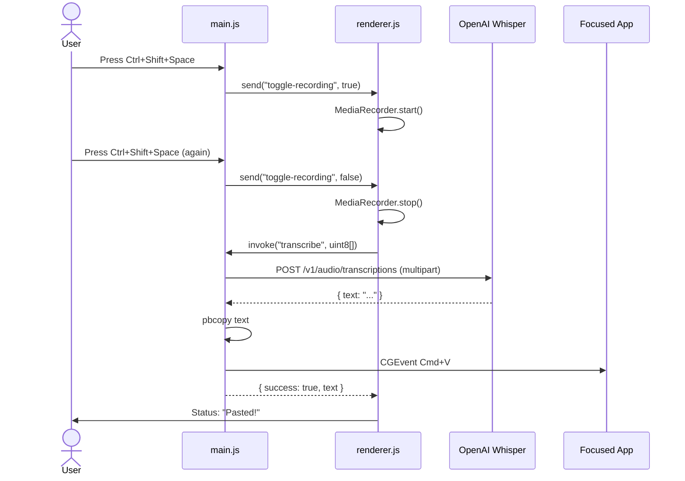

# Ada Documentation & AI Workflow Implementation Plan

> **For agentic workers:** REQUIRED SUB-SKILL: Use superpowers:subagent-driven-development (recommended) or superpowers:executing-plans to implement this plan task-by-task. Steps use checkbox (`- [ ]`) syntax for tracking.

**Goal:** Add a `docs/` folder explaining Ada's structure and features, and four `.claude/commands/` slash commands that automate Ada's build, dev, and diagnostic rituals.

**Architecture:** Two new top-level directories. `docs/` contains seven topic-focused markdown files plus an index. `.claude/commands/` contains four markdown files — each is a Claude Code slash command (YAML frontmatter + prompt body). Existing `README.md` and `CLAUDE.md` are trimmed to point at the new docs and avoid duplication. No source code changes.

**Tech Stack:** Markdown, Mermaid (sequence diagram), Claude Code slash-command format (YAML frontmatter + prompt body).

**Reference spec:** `docs/superpowers/specs/2026-05-02-ada-docs-and-skills-design.md`

**Branch:** `docs/ada-documentation-and-skills` (already created and contains the spec commit).

---

## Verification approach (no test framework)

The project has no test infrastructure. Each task's verification step is a small shell check that confirms the expected file content landed correctly:

- For markdown docs: `grep -q '<expected heading>' <file>` to confirm key sections exist.
- For slash commands: a Python one-liner that parses the YAML frontmatter and confirms `description` is set.
- After each task: `git status` to confirm only the expected files changed, then commit.

The acceptance test for the slash commands themselves is manual: typing `/build-clean`, `/reset-perms`, `/dev`, or `/diagnose-mic` in a Claude Code session inside this repo and confirming Claude executes the documented behavior. This is called out in Task 13.

---

## Task 1: Create `docs/README.md` (index)

**Files:**
- Create: `docs/README.md`

- [ ] **Step 1: Create the file**

```markdown
# Ada Documentation

Long-form documentation for Ada, the macOS speech-to-text desktop app.
The top-level [`README.md`](../README.md) is the quick-start; this folder
covers everything else.

## Contents

- [Architecture](architecture.md) — Electron multi-process model, IPC contract, end-to-end flow.
- [Build & Release](build-and-release.md) — The clean build & install ritual, with the *why* behind each step.
- [Permissions](permissions.md) — macOS Microphone and Accessibility grants, how they're requested, and how to check status.
- [Whisper Integration](whisper-integration.md) — How Ada talks to OpenAI Whisper: endpoint, multipart body, audio format chain, failure modes.
- [Troubleshooting](troubleshooting.md) — Symptom-keyed punch list for common breakage.
- [Development Workflow](development-workflow.md) — How the four project-local slash commands fit into a normal day of work.
```

- [ ] **Step 2: Verify content landed**

Run: `grep -E '^- \[' docs/README.md | wc -l`
Expected: `6` (six bullet links).

- [ ] **Step 3: Commit**

```bash
git add docs/README.md
git commit -m "docs: add docs/ index"
```

---

## Task 2: Create `docs/architecture.md`

**Files:**
- Create: `docs/architecture.md`

- [ ] **Step 1: Create the file**

```markdown
# Architecture

Ada is a macOS Electron app. A global keyboard shortcut toggles
recording; the captured audio is sent to OpenAI Whisper for
transcription; the transcribed text is copied to the clipboard and
pasted into the focused application via simulated `Cmd+V`.

## Process model

Electron runs three logical layers, each with a distinct responsibility:

- **Main process (`main.js`)** — owns the app lifecycle, the system
  tray, the global shortcut registration, and all privileged work:
  reading `config.json`, calling the Whisper API over `fetch`, writing
  to the system clipboard via `pbcopy`, and posting the synthetic
  `Cmd+V` keystroke via `CGEventPost`.
- **Renderer process (`renderer.js` loaded by `index.html`)** — owns
  the microphone. Uses the browser `MediaRecorder` API to capture WebM
  audio. Has no direct OS access; communicates with main exclusively
  through the preload bridge.
- **Preload (`preload.js`)** — the IPC bridge. Runs with
  `contextIsolation: true` and `nodeIntegration: false`, exposing a
  small typed surface on `window.ada` to the renderer.

## File map

| File | Role |
|---|---|
| `main.js` | Main process entry. App, tray, shortcut, Whisper, paste. |
| `renderer.js` | Renderer logic. MediaRecorder + UI status updates. |
| `preload.js` | IPC bridge. Exposes `window.ada` to the renderer. |
| `index.html` | Hidden status window the renderer runs inside. |
| `dashboard.html` | Optional dashboard window opened from the tray menu. |
| `entitlements.plist` | Microphone entitlement signed into the bundle. |
| `paste-helper.swift` / `paste-helper` | Standalone Swift binary that does clipboard + `Cmd+V`. **Not currently invoked at runtime** (main.js uses an inline JXA `osascript` instead). Kept as a fallback. |
| `config.json` | OpenAI API key + model name. Gitignored. |
| `trayIconTemplate.png` (+`@2x`) | Tray icon, template-rendered for macOS dark/light. |

## IPC contract

The preload bridge exposes exactly two functions on `window.ada`:

| Name | Direction | Payload | Returns |
|---|---|---|---|
| `onToggleRecording(callback)` | main → renderer | `boolean` (true = start, false = stop) | n/a |
| `transcribe(audioBuffer)` | renderer → main | `number[]` (Uint8Array serialized as plain array) | `{ success: true, text: string } \| { success: false, error: any }` |

The main process triggers `toggle-recording` from the registered
global shortcut handler. The renderer responds by starting or stopping
`MediaRecorder` and, on stop, invoking `transcribe` with the
accumulated audio.

## End-to-end flow



For the build-time concerns that surround this runtime flow, see
[Build & Release](build-and-release.md). For the permissions each step
requires, see [Permissions](permissions.md).
```

- [ ] **Step 2: Verify content landed**

Run: `grep -c '^## ' docs/architecture.md`
Expected: `4` (Process model, File map, IPC contract, End-to-end flow).

Run: `grep -q 'mermaid' docs/architecture.md && echo OK`
Expected: `OK`.

- [ ] **Step 3: Commit**

```bash
git add docs/architecture.md
git commit -m "docs: explain architecture, IPC contract, and end-to-end flow"
```

---

## Task 3: Create `docs/build-and-release.md`

**Files:**
- Create: `docs/build-and-release.md`

- [ ] **Step 1: Create the file**

```markdown
# Build & Release

> **Most of the time, run `/build-clean` instead of doing this by hand.**
> The slash command (`.claude/commands/build-clean.md`) automates every
> step below. This document exists to explain *why* each step matters
> so you can debug when the slash command fails.

Producing a working `/Applications/Ada.app` from source is a five-step
ritual. Skipping any step (especially the re-sign) produces a build
that looks installed but silently fails to record audio or paste text.

## Step 1: Reset macOS permissions

```bash
tccutil reset Microphone com.programow.ada
tccutil reset Accessibility com.programow.ada
```

**Why:** macOS TCC (Transparency, Consent, and Control) caches
permission decisions against the tuple `(bundle-id, code-signing-identity)`.
A re-signed build looks like a different app to TCC even though the
bundle id is unchanged. Resetting forces TCC to re-prompt on next
launch. Without this, a denial granted to a previous build silently
carries over and the user never sees a prompt.

## Step 2: Remove the previous install and build artifacts

```bash
rm -rf /Applications/Ada.app dist/
```

**Why:** Copying a freshly-signed bundle on top of an existing
differently-signed bundle produces signature-validation errors that
are hard to diagnose. A clean copy is reliable. `dist/` is wiped so
the build doesn't pick up stale outputs.

## Step 3: Build the bundle

```bash
npm run build
```

**What it produces:** electron-builder writes `dist/mac-arm64/Ada.app`
and a corresponding `dist/Ada-<version>-arm64.dmg`. The `.app` is what
you install; the `.dmg` is what you'd ship to a user.

## Step 4: Install

```bash
cp -R dist/mac-arm64/Ada.app /Applications/Ada.app
```

A plain recursive copy is sufficient. macOS does not need any further
registration step for `.app` bundles.

## Step 5: Re-sign with entitlements (the critical step)

```bash
codesign --force --deep --sign - --entitlements entitlements.plist /Applications/Ada.app
```

**Why:** electron-builder ad-hoc signs (`--sign -`) the outer bundle,
but its current behavior does not reliably propagate the entitlements
file to *nested* binaries inside the bundle (Helper.app, frameworks).
The microphone capability
(`com.apple.security.device.audio-input`) needs to be present on the
binaries that actually call into CoreAudio, not just the outer
launcher. `--deep` walks the bundle and re-signs every nested binary
with the same entitlements file; `--force` overrides the existing
electron-builder signature.

Without this step: the app launches, but `getUserMedia` returns no
audio and the renderer console shows a permission error — even after
you "granted" microphone access, because the inner binary that
actually requested it was never entitled to ask.

## Verifying the install

Confirm entitlements actually stuck on the installed bundle:

```bash
codesign -d --entitlements - /Applications/Ada.app
```

Look for `<key>com.apple.security.device.audio-input</key>` followed
by `<true/>` in the output. If it's missing, step 5 didn't run
or didn't apply. Re-run it.

Confirm the signature itself is valid:

```bash
codesign --verify --verbose /Applications/Ada.app
```

Expected: `valid on disk` and `satisfies its Designated Requirement`.

## After install

Launch Ada from `/Applications/Ada.app`. macOS should prompt for
Microphone, then later for Accessibility (the latter is needed so the
synthetic `Cmd+V` keystroke can reach other apps). Approve both. If
no prompts appear, run [`/reset-perms`](../.claude/commands/reset-perms.md)
and relaunch — a previous denial may be cached.

For permission troubleshooting, see [Permissions](permissions.md).
For general failures, see [Troubleshooting](troubleshooting.md).
```

- [ ] **Step 2: Verify content landed**

Run: `grep -c '^## ' docs/build-and-release.md`
Expected: at least `7` (5 step headings + Verifying + After install).

Run: `grep -q '\-\-deep' docs/build-and-release.md && echo OK`
Expected: `OK`.

- [ ] **Step 3: Commit**

```bash
git add docs/build-and-release.md
git commit -m "docs: document the clean build & install ritual with rationale"
```

---

## Task 4: Create `docs/permissions.md`

**Files:**
- Create: `docs/permissions.md`

- [ ] **Step 1: Create the file**

```markdown
# Permissions

Ada needs two macOS privacy grants to function: **Microphone** (to
record audio) and **Accessibility** (to inject the synthetic `Cmd+V`
keystroke into the focused application). Both are gated by macOS TCC
and both behave differently in dev mode versus a packaged build.

## Microphone

**Granted via:** TCC, prompted on first `getUserMedia` call.

**Required pieces:**

1. **Entitlement** — `com.apple.security.device.audio-input` must be
   signed into every binary in the bundle that calls into CoreAudio.
   Source: [`entitlements.plist`](../entitlements.plist). Applied during
   the re-sign step in the build ritual; see
   [build-and-release.md](build-and-release.md).
2. **Usage description** — `NSMicrophoneUsageDescription` in
   `Info.plist`. Set via `build.mac.extendInfo` in `package.json`.
   Without it, macOS rejects the permission request without a prompt.
3. **Runtime trigger** — `main.js` calls
   `systemPreferences.askForMediaAccess('microphone')` on app start.
   This is what produces the prompt the user sees.

**To check status:**

- System Settings → Privacy & Security → Microphone → look for `Ada`.
- Or via the diagnostic slash command: `/diagnose-mic` (read-only).

## Accessibility

**Granted via:** TCC, prompted on first attempt to post a synthetic
keyboard event.

**Required pieces:**

1. **Runtime trigger** — `main.js` calls
   `systemPreferences.isTrustedAccessibilityClient(true)` on app start.
   The `true` argument tells macOS to prompt the user if the app
   isn't already trusted.
2. **Approval scope** — the user must toggle Ada on under System
   Settings → Privacy & Security → Accessibility. Unlike Microphone,
   the prompt only opens System Settings; the user has to flip the
   toggle themselves and (depending on macOS version) authenticate.

**Why Accessibility is needed:** the paste step uses
`CGEventPost(.cghidEventTap, ...)` to inject `Cmd+V` into whichever
app has focus. macOS treats event injection as input monitoring,
which is gated by Accessibility, not Microphone.

## Dev mode vs packaged build

`npm start` runs Electron from your terminal. Both Microphone and
Accessibility permissions are inherited from the parent process —
specifically, from your terminal application (Terminal.app, iTerm,
Ghostty, etc.). If the terminal already has those grants, dev-mode
Ada just works without prompting. This is convenient but it means a
dev build is **not** a fair test of the packaged permission flow.

A packaged build (`/Applications/Ada.app`) has its own bundle id
(`com.programow.ada`) and asks TCC for its own grants. Always test
permission-related changes against the packaged build.

## Resetting

If prompts no longer appear, TCC has cached a decision. Reset with:

```bash
tccutil reset Microphone com.programow.ada
tccutil reset Accessibility com.programow.ada
```

Or run [`/reset-perms`](../.claude/commands/reset-perms.md). Then
relaunch Ada.
```

- [ ] **Step 2: Verify content landed**

Run: `grep -E '^## (Microphone|Accessibility|Dev mode|Resetting)' docs/permissions.md | wc -l`
Expected: `4`.

- [ ] **Step 3: Commit**

```bash
git add docs/permissions.md
git commit -m "docs: explain microphone and accessibility permission requirements"
```

---

## Task 5: Create `docs/whisper-integration.md`

**Files:**
- Create: `docs/whisper-integration.md`

- [ ] **Step 1: Create the file**

```markdown
# Whisper Integration

Ada transcribes audio with [OpenAI Whisper](https://platform.openai.com/docs/api-reference/audio).
All Whisper calls happen in the main process (`main.js`); the renderer
never sees the API key.

## Endpoint

```
POST https://api.openai.com/v1/audio/transcriptions
Authorization: Bearer <key>
Content-Type: multipart/form-data; boundary=<boundary>
```

The response is JSON; on success it contains a `text` field with the
transcript.

## Multipart body construction

The body is built by hand in `main.js` rather than via a library like
`form-data`. This keeps the project zero-runtime-dependency. The body
has exactly two parts:

1. **`file`** — the recorded audio, sent as `audio.webm` with
   `Content-Type: audio/webm`.
2. **`model`** — the model name from `config.json`, e.g. `whisper-1`.

See `main.js` for the exact construction. If you ever need to add a
third field (e.g., `language`, `prompt`, `temperature`), follow the
same pattern: a header block, a value, a `\r\n`, terminated with the
closing `--<boundary>--\r\n`.

## Audio format chain

The bytes that hit Whisper traverse three representations:

```
MediaRecorder (renderer)  →  audio/webm Blob
                          →  ArrayBuffer
                          →  Array.from(Uint8Array)   // serialize for IPC
               IPC → main
                          →  Buffer.from(array)
                          →  appended to multipart body
                          →  POST as audio/webm
```

The IPC hop converts the `Uint8Array` to a plain JavaScript array
because Electron's structured-clone IPC handles arrays cleanly across
the context-isolation boundary. The cost is one extra copy.

## `config.json` schema

```json
{
  "openai_api_key": "sk-...",
  "model": "whisper-1"
}
```

- `openai_api_key` (string, required) — your OpenAI API key.
- `model` (string, required) — Whisper model id. `whisper-1` is the
  only generally-available transcription model at time of writing.

**Never commit `config.json`.** It's in [`.gitignore`](../.gitignore)
for exactly this reason.

## Failure modes

| Symptom | Cause | What the renderer sees |
|---|---|---|
| `data.text` is missing, `data.error` set | Bad/expired API key, wrong model id, malformed multipart | `result.success === false` with `error` from API |
| Network error from `fetch` | Offline, DNS, OpenAI outage | `result.success === false` with `error.message` |
| Empty transcription (`text` is `""` or whitespace) | Mic was muted, recording too short, no speech detected | `result.success === true`, but `text` is empty — paste happens with empty content |
| Hang on "Processing..." | `fetch` timed out without resolving | No `result` returned |

The "empty transcription pastes nothing" case is intentional: Whisper
occasionally returns whitespace for audio it can't transcribe, and
pasting it is harmless. If a future change wants to suppress that,
check `data.text.trim()` in `main.js` before calling `pasteText`.
```

- [ ] **Step 2: Verify content landed**

Run: `grep -c '^## ' docs/whisper-integration.md`
Expected: at least `5` (Endpoint, Multipart, Audio format, config.json, Failure modes).

- [ ] **Step 3: Commit**

```bash
git add docs/whisper-integration.md
git commit -m "docs: document Whisper API integration and config.json schema"
```

---

## Task 6: Create `docs/troubleshooting.md`

**Files:**
- Create: `docs/troubleshooting.md`

- [ ] **Step 1: Create the file**

```markdown
# Troubleshooting

Keyed by symptom. Each entry tells you how to confirm the cause, then
how to fix it.

## Shortcut does nothing when pressed

**Possible causes:**

- **Another app holds `Control+Shift+Space`.** Try the shortcut with
  Ada quit; if something else still happens, that app owns the chord.
  Quit the conflicting app or change Ada's shortcut in `main.js`.
- **Accessibility not granted.** Even though the shortcut is
  *registered* by Electron's `globalShortcut`, the system can
  drop key events for unprivileged processes. Confirm via System
  Settings → Privacy & Security → Accessibility. If Ada is missing
  or off, toggle it on and relaunch.
- **Ada isn't running.** Check `pgrep -f Ada.app` or look at the menu
  bar for the tray icon.

## Recording starts (UI flips to red mic) but transcription is empty

**Possible causes:**

- **Mic muted at the OS level.** System Settings → Sound → Input —
  confirm input level moves when you speak.
- **Wrong default input device.** macOS may have switched to a
  Bluetooth input that isn't actually receiving audio.
- **Entitlements not signed into the packaged bundle.** Run
  `/diagnose-mic` or `codesign -d --entitlements - /Applications/Ada.app`
  and look for `com.apple.security.device.audio-input`. If missing,
  re-run `/build-clean`.

## UI says "Pasted!" but nothing pastes into the focused app

**Cause:** Accessibility permission absent or revoked. The text *is*
on the clipboard — you can `Cmd+V` manually and it works. What's
broken is Ada's ability to inject the keystroke.

**Fix:** System Settings → Privacy & Security → Accessibility → toggle
Ada on. If Ada isn't listed, relaunch it once — the runtime call to
`isTrustedAccessibilityClient(true)` will register it.

## App crashes immediately on launch

**Cause:** `config.json` is missing or malformed. `main.js` loads it
synchronously at startup with `JSON.parse` and no try/catch.

**Fix:** Verify the file exists and parses:

```bash
cat config.json | python3 -m json.tool
```

It must contain `openai_api_key` and `model`. See
[whisper-integration.md](whisper-integration.md) for the schema.

## Re-installed build asks for no permission prompts

**Cause:** macOS TCC has cached a previous decision (likely a denial)
for `com.programow.ada`. Even fresh re-installs inherit it.

**Fix:** Run [`/reset-perms`](../.claude/commands/reset-perms.md) (or
the `tccutil reset` commands by hand), then relaunch Ada.

## Whisper returns 401 Unauthorized

**Cause:** API key in `config.json` is wrong, expired, or revoked.

**Fix:** Generate a new key at
[platform.openai.com](https://platform.openai.com/api-keys), update
`config.json`, and run `/dev` to restart.

## Whisper returns 429 Rate Limited

**Cause:** Account-level rate limit hit. Most common with free-tier
or low-tier OpenAI accounts speaking continuously.

**Fix:** Wait, or upgrade the OpenAI account tier.
```

- [ ] **Step 2: Verify content landed**

Run: `grep -c '^## ' docs/troubleshooting.md`
Expected: at least `7`.

- [ ] **Step 3: Commit**

```bash
git add docs/troubleshooting.md
git commit -m "docs: add symptom-keyed troubleshooting punch list"
```

---

## Task 7: Create `docs/development-workflow.md`

**Files:**
- Create: `docs/development-workflow.md`

- [ ] **Step 1: Create the file**

```markdown
# Development Workflow

Ada ships with four project-local Claude Code slash commands under
[`.claude/commands/`](../.claude/commands/). They automate the
rituals that this project would otherwise require you to remember
and run by hand.

## When to use which command

| You're doing… | Run | Why |
|---|---|---|
| Editing JS/HTML, want to see the change | `/dev` | Inherits terminal permissions, no build needed. |
| Testing the packaged app behavior (entitlements, signing, dock, tray) | `/build-clean` | Only the packaged build exercises the real permission and signing pipeline. |
| TCC prompts misbehaving (no prompt, or you need to retest the prompt flow) | `/reset-perms` | Clears the cached decision so prompts re-fire. |
| Mic / paste / packaged build broken, don't know why yet | `/diagnose-mic` | Read-only. Tells you which of (missing app, missing entitlements, invalid signature, missing config) is the cause. |

## What each command does

- **`/dev`** — verifies `config.json` exists and has a real API key,
  then runs `npm start` in the foreground.
- **`/reset-perms`** — runs `tccutil reset` for both Microphone and
  Accessibility, scoped to `com.programow.ada`. Idempotent and
  non-destructive. Tells you to relaunch Ada.
- **`/build-clean`** — the full five-step ritual from
  [build-and-release.md](build-and-release.md): TCC reset, remove the
  installed app and `dist/`, build, copy, re-sign with entitlements.
  Asks for confirmation before `rm -rf`. Verifies entitlements after
  signing.
- **`/diagnose-mic`** — a read-only checklist. Confirms
  `/Applications/Ada.app` is present, entitlements are signed in, the
  signature is valid, the app is running, and `config.json` is well
  formed. Reports each as ✓ / ✗.

## When to bypass the slash commands

You shouldn't normally, but valid cases:

- **Iterating on `main.js`** without rebuilding: just `npm start`.
  `/dev` does the same plus a sanity check, but if you've already
  validated the config, plain `npm start` is fine.
- **Reproducing a specific signing bug:** you may want to *omit* the
  `--deep` flag or the entitlements file to confirm a hypothesis.
  `/build-clean` won't let you skip those steps.
- **Investigating TCC behavior with a non-Ada bundle id:** `tccutil`
  by hand, since `/reset-perms` hardcodes `com.programow.ada`.

## Adding a new command

Drop a new markdown file in `.claude/commands/<name>.md` with:

```markdown
---
description: One-line summary shown in the slash-command picker.
---

Body of the prompt that Claude executes when the user types /<name>.
Write it as instructions to Claude, not to the user.
```

Claude Code picks it up automatically on the next session.
```

- [ ] **Step 2: Verify content landed**

Run: `grep -E '`/(dev|reset-perms|build-clean|diagnose-mic)`' docs/development-workflow.md | wc -l`
Expected: at least `4`.

- [ ] **Step 3: Commit**

```bash
git add docs/development-workflow.md
git commit -m "docs: explain when to use each slash command"
```

---

## Task 8: Create `.claude/commands/reset-perms.md`

**Files:**
- Create: `.claude/commands/reset-perms.md`

- [ ] **Step 1: Create the file**

```markdown
---
description: Reset macOS Microphone and Accessibility permissions for Ada (com.programow.ada). Use when permission prompts no longer appear or to retest the grant flow.
---

Reset the macOS TCC entries for Ada so that Microphone and Accessibility
prompts will fire again on next launch.

Run these two commands sequentially:

```bash
tccutil reset Microphone com.programow.ada
tccutil reset Accessibility com.programow.ada
```

If either command exits non-zero, report the error and stop. `tccutil`
occasionally fails when the system has never seen a TCC entry for the
bundle id, which is harmless — mention this if you see it.

After both succeed, tell the user:

> Permissions reset. Relaunch Ada from `/Applications/Ada.app` so macOS re-prompts for Microphone, then later for Accessibility. If no prompts appear, the bundle is missing entitlements — run `/diagnose-mic`.

Do not run any other commands. This command is intentionally minimal.
```

- [ ] **Step 2: Verify frontmatter parses**

Run:
```bash
python3 -c "
import sys, re
body = open('.claude/commands/reset-perms.md').read()
m = re.match(r'^---\n(.*?)\n---', body, re.DOTALL)
assert m, 'no frontmatter'
fm = m.group(1)
assert 'description:' in fm, 'no description field'
print('OK')
"
```
Expected: `OK`.

- [ ] **Step 3: Commit**

```bash
git add .claude/commands/reset-perms.md
git commit -m "feat(claude): add /reset-perms slash command"
```

---

## Task 9: Create `.claude/commands/dev.md`

**Files:**
- Create: `.claude/commands/dev.md`

- [ ] **Step 1: Create the file**

```markdown
---
description: Start Ada in dev mode (npm start) after sanity-checking config.json.
---

Start Ada in dev mode. Before running `npm start`, perform these
sanity checks and abort with a clear message if any fails:

1. **`config.json` exists.** Run `test -f config.json`. If it's
   missing, tell the user to create it using the schema in
   `docs/whisper-integration.md` and stop.

2. **`config.json` parses as JSON.** Run
   `python3 -m json.tool config.json > /dev/null`. If it errors,
   show the user the error and stop.

3. **`openai_api_key` is set and not the placeholder `sk-...`.** Run:
   ```bash
   python3 -c "import json; k=json.load(open('config.json')).get('openai_api_key',''); import sys; sys.exit(0 if k and k != 'sk-...' else 1)"
   ```
   If it exits non-zero, tell the user to put a real OpenAI API key in
   `config.json` and stop.

If all three pass, run:

```bash
npm start
```

In the foreground. Do not background it — the user wants to see the
Electron stdout/stderr live and stop the app with Ctrl+C.
```

- [ ] **Step 2: Verify frontmatter parses**

Run:
```bash
python3 -c "
import re
body = open('.claude/commands/dev.md').read()
m = re.match(r'^---\n(.*?)\n---', body, re.DOTALL)
assert m and 'description:' in m.group(1)
print('OK')
"
```
Expected: `OK`.

- [ ] **Step 3: Commit**

```bash
git add .claude/commands/dev.md
git commit -m "feat(claude): add /dev slash command with config.json sanity check"
```

---

## Task 10: Create `.claude/commands/diagnose-mic.md`

**Files:**
- Create: `.claude/commands/diagnose-mic.md`

- [ ] **Step 1: Create the file**

```markdown
---
description: Read-only diagnostic for Ada's microphone / packaged build. Reports a punch list of ✓ / ✗ checks. Does not modify state.
---

Run the following checks in order. For each, print a single line of
the form `✓ <description>` or `✗ <description> — <fix hint>`. Do not
modify any state. After all checks, print a one-line summary.

## Check 1: Is `/Applications/Ada.app` present?

```bash
test -d /Applications/Ada.app
```

Fix hint if missing: "Run `/build-clean` to build and install."

## Check 2: Are entitlements signed into the bundle?

```bash
codesign -d --entitlements - /Applications/Ada.app 2>&1 | grep -q 'com.apple.security.device.audio-input'
```

Fix hint if missing: "Re-sign with `codesign --force --deep --sign - --entitlements entitlements.plist /Applications/Ada.app` or run `/build-clean`."

Skip this check if Check 1 failed.

## Check 3: Is the bundle's signature valid?

```bash
codesign --verify --verbose /Applications/Ada.app 2>&1
```

Valid output contains `valid on disk` and `satisfies its Designated Requirement`. If anything else, the signature is broken.

Fix hint if invalid: "Run `/build-clean` for a clean rebuild and re-sign."

Skip if Check 1 failed.

## Check 4: Is Ada currently running?

```bash
pgrep -f /Applications/Ada.app >/dev/null
```

Note: this is informational, not a failure mode. If Ada isn't running,
report "Ada is not currently running" — not a ✗.

## Check 5: Does `config.json` exist with a non-placeholder API key?

```bash
test -f config.json && python3 -c "import json,sys; k=json.load(open('config.json')).get('openai_api_key',''); sys.exit(0 if k and k!='sk-...' else 1)"
```

Fix hint if missing/placeholder: "Edit `config.json` and set a real `openai_api_key`. Schema in `docs/whisper-integration.md`."

## Summary

After all checks, print:

- If everything passed: "All checks passed. If mic still doesn't work, the issue is likely TCC: open System Settings → Privacy & Security → Microphone and confirm Ada is enabled. If absent, run `/reset-perms` and relaunch Ada."
- If anything failed: "Failures above. Address them top-to-bottom — missing app blocks the rest."

This command is read-only. Do not run any commands that modify state
(no `tccutil`, no `rm`, no `codesign --force`).
```

- [ ] **Step 2: Verify frontmatter parses**

Run:
```bash
python3 -c "
import re
body = open('.claude/commands/diagnose-mic.md').read()
m = re.match(r'^---\n(.*?)\n---', body, re.DOTALL)
assert m and 'description:' in m.group(1)
print('OK')
"
```
Expected: `OK`.

- [ ] **Step 3: Commit**

```bash
git add .claude/commands/diagnose-mic.md
git commit -m "feat(claude): add /diagnose-mic read-only diagnostic command"
```

---

## Task 11: Create `.claude/commands/build-clean.md`

**Files:**
- Create: `.claude/commands/build-clean.md`

- [ ] **Step 1: Create the file**

```markdown
---
description: Run the full clean build & install ritual for Ada. Resets TCC, rebuilds, re-signs with entitlements. Destructive — confirms before deleting.
---

Run Ada's five-step clean build & install ritual end-to-end. The full
rationale for each step is in `docs/build-and-release.md`. Do not
skip any step — in particular, step 5 (re-sign with entitlements) is
the entire reason this command exists.

## Preflight

Before running anything, confirm the working directory is the Ada
repo root:

```bash
test -f main.js && test -f entitlements.plist && test -f package.json
```

If any check fails, abort with: "Not in the Ada repo root. Refusing to run destructive build steps."

## Confirm with the user

Print these five steps that are about to run:

1. `tccutil reset` Microphone + Accessibility for `com.programow.ada`
2. `rm -rf /Applications/Ada.app dist/`
3. `npm run build`
4. `cp -R dist/mac-arm64/Ada.app /Applications/Ada.app`
5. `codesign --force --deep --sign - --entitlements entitlements.plist /Applications/Ada.app`

Then ask: "This will delete `/Applications/Ada.app` and `dist/`. Proceed?"
Wait for explicit confirmation. If the user declines, stop.

## Run the ritual

Run the steps sequentially. Halt on the first non-zero exit and report which step failed:

### Step 1: Reset TCC

```bash
tccutil reset Microphone com.programow.ada
tccutil reset Accessibility com.programow.ada
```

`tccutil reset` may exit non-zero if the bundle id has no existing TCC
entry; treat that specific case as success and continue.

### Step 2: Remove the previous install and dist

```bash
rm -rf /Applications/Ada.app dist/
```

### Step 3: Build

```bash
npm run build
```

This runs electron-builder and produces `dist/mac-arm64/Ada.app`.
Report progress; the build can take 30–60 seconds.

### Step 4: Install

```bash
cp -R dist/mac-arm64/Ada.app /Applications/Ada.app
```

### Step 5: Re-sign with entitlements (critical)

```bash
codesign --force --deep --sign - --entitlements entitlements.plist /Applications/Ada.app
```

Do not skip this step. Do not omit `--deep`. Do not omit `--entitlements entitlements.plist`.

## Verify

After step 5, confirm entitlements stuck:

```bash
codesign -d --entitlements - /Applications/Ada.app 2>&1 | grep 'com.apple.security.device.audio-input'
```

Expected: a line containing the entitlement key. If the grep finds
nothing, step 5 didn't apply — report the failure to the user.

## Done

If everything succeeded, tell the user:

> Build clean. Launch Ada from `/Applications/Ada.app`. macOS will
> prompt for Microphone access; later, when you press the shortcut,
> for Accessibility. Approve both. If no prompts appear, run
> `/diagnose-mic`.
```

- [ ] **Step 2: Verify frontmatter parses**

Run:
```bash
python3 -c "
import re
body = open('.claude/commands/build-clean.md').read()
m = re.match(r'^---\n(.*?)\n---', body, re.DOTALL)
assert m and 'description:' in m.group(1)
print('OK')
"
```
Expected: `OK`.

- [ ] **Step 3: Commit**

```bash
git add .claude/commands/build-clean.md
git commit -m "feat(claude): add /build-clean slash command for the full ritual"
```

---

## Task 12: Update root `README.md` to point at `docs/`

**Files:**
- Modify: `README.md`

- [ ] **Step 1: Replace the entire file**

Use a full-file overwrite. New content:

```markdown
# Ada

A macOS desktop app that provides global speech-to-text. Press a
global shortcut to record audio, which is transcribed via OpenAI
Whisper API and pasted into the active application.

For architecture, build details, permissions, and troubleshooting,
see [`docs/`](docs/README.md).

## Setup

1. Install dependencies:

   ```
   npm install
   ```

2. Create `config.json` in the project root (schema in
   [`docs/whisper-integration.md`](docs/whisper-integration.md)):

   ```json
   {
     "openai_api_key": "sk-...",
     "model": "whisper-1"
   }
   ```

## Development

Run the app directly with Electron (inherits terminal permissions, no
signing needed):

```
npm start
```

Or, inside a Claude Code session, run `/dev` which adds a
`config.json` sanity check.

## Build & Install

The short version:

```
npm run build
cp -R dist/mac-arm64/Ada.app /Applications/Ada.app
codesign --force --deep --sign - --entitlements entitlements.plist /Applications/Ada.app
```

For the full ritual (with TCC reset and the *why* behind each step),
see [`docs/build-and-release.md`](docs/build-and-release.md). Inside
a Claude Code session, run `/build-clean` to do all of it
automatically.

## Usage

- **Ctrl+Shift+Space** — Toggle recording.
- The app lives in the system tray. Right-click the tray icon to open
  the dashboard or quit.

## Platform

macOS-only. Requires Accessibility and Microphone permissions — see
[`docs/permissions.md`](docs/permissions.md).
```

- [ ] **Step 2: Verify the new content landed**

Run: `grep -q 'docs/README.md' README.md && echo OK`
Expected: `OK`.

Run: `grep -q '/build-clean' README.md && echo OK`
Expected: `OK`.

- [ ] **Step 3: Commit**

```bash
git add README.md
git commit -m "docs: trim README and link to docs/ for deeper guides"
```

---

## Task 13: Update `CLAUDE.md` to reference the slash command

**Files:**
- Modify: `CLAUDE.md`

- [ ] **Step 1: Replace the "Clean Build & Install Ritual" section**

Find the section starting with `## Clean Build & Install Ritual` and ending just before the next top-level section (or end of file). Replace its body with the shorter version below.

Use the Edit tool with `old_string` matching the existing section verbatim:

```
## Clean Build & Install Ritual

Every time we need to test a packaged build, run these steps in order:

```bash
# 1. Reset macOS permissions
tccutil reset Microphone com.programow.ada
tccutil reset Accessibility com.programow.ada

# 2. Remove existing app and build artifacts
rm -rf /Applications/Ada.app
rm -rf dist/

# 3. Build
npm run build

# 4. Install and re-sign with entitlements
cp -R dist/mac-arm64/Ada.app /Applications/Ada.app
codesign --force --deep --sign - --entitlements entitlements.plist /Applications/Ada.app
```

The re-signing step is required because electron-builder's ad-hoc signing doesn't properly apply entitlements to nested binaries. The `--deep` flag ensures all frameworks/helpers inside the bundle get signed with the microphone entitlement.

After launching, macOS will prompt for both **Microphone** and **Accessibility** permissions.
```

Replace with `new_string`:

```
## Clean Build & Install Ritual

Use `/build-clean` (defined in `.claude/commands/build-clean.md`). It
automates the full ritual: TCC reset, remove the installed app and
`dist/`, build, copy, and re-sign with entitlements.

The ritual is documented in detail — with the rationale for each step
— in [`docs/build-and-release.md`](docs/build-and-release.md). Don't
skip the re-sign step: electron-builder's ad-hoc signing doesn't
propagate the microphone entitlement to nested binaries on its own.

After launching the new build, macOS will prompt for **Microphone**
and **Accessibility** permissions.
```

- [ ] **Step 2: Verify the change landed**

Run: `grep -q '/build-clean' CLAUDE.md && echo OK`
Expected: `OK`.

Run: `grep -c '^tccutil reset' CLAUDE.md`
Expected: `0` (no inline ritual commands left in CLAUDE.md).

- [ ] **Step 3: Commit**

```bash
git add CLAUDE.md
git commit -m "docs: replace inline build ritual in CLAUDE.md with link to /build-clean"
```

---

## Task 14: Manual acceptance test of the slash commands

**Files:** none (interactive verification).

This task can't be automated — the slash commands are executed by
Claude Code's interactive layer. Run each command from a Claude Code
session in the repo root and verify the documented behavior.

- [ ] **Step 1: Test `/diagnose-mic`** (read-only, safe to run first)

  Open a Claude Code session in this repo and type `/diagnose-mic`.
  Expected: Claude prints ✓ / ✗ lines for each of the five checks.
  No file changes, no `tccutil`, no `codesign --force`.

- [ ] **Step 2: Test `/dev`**

  Type `/dev`. If `config.json` is missing or has the placeholder key,
  Claude reports it and does not run `npm start`. If config is good,
  Claude runs `npm start` in the foreground.

- [ ] **Step 3: Test `/reset-perms`**

  Type `/reset-perms`. Claude runs both `tccutil reset` commands and
  prints the relaunch instruction.

- [ ] **Step 4: Test `/build-clean`** (destructive — last)

  Type `/build-clean`. Claude prints the five steps, asks for
  confirmation, then runs each. After step 5, Claude verifies
  entitlements with `codesign -d --entitlements -` and confirms the
  microphone entitlement is present.

- [ ] **Step 5: No commit** — this task documents that the manual
  test happened. If any command misbehaved, fix the relevant
  `.claude/commands/<name>.md` and add a new commit.

---

## Task 15: Open a pull request (optional, only if working off a fork or shared remote)

This project currently has no remote configured for PRs. Skip this
task unless the user has set up a remote and explicitly asked for a
PR. Otherwise, this branch can simply be merged into `main` locally
when ready.

- [ ] **Step 1:** Confirm with the user whether to open a PR or
  merge directly to `main`.

- [ ] **Step 2 (merge path):** `git checkout main && git merge --no-ff docs/ada-documentation-and-skills`

- [ ] **Step 3 (PR path):** `gh pr create` with a title summarizing the
  branch and a body referencing the spec at
  `docs/superpowers/specs/2026-05-02-ada-docs-and-skills-design.md`.
